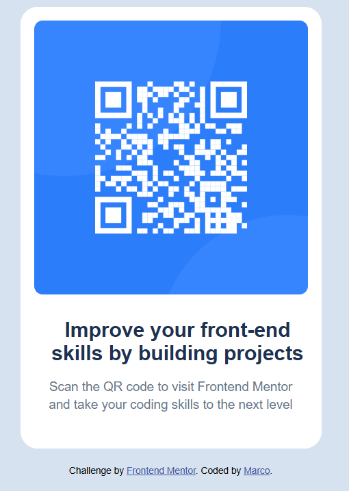

# Frontend Mentor - QR code component solution

This is a solution to the [QR code component challenge on Frontend Mentor](https://www.frontendmentor.io/challenges/qr-code-component-iux_sIO_H). Frontend Mentor challenges help you improve your coding skills by building realistic projects. 

## Table of contents

- [Frontend Mentor - QR code component solution](#frontend-mentor---qr-code-component-solution)
  - [Table of contents](#table-of-contents)
  - [Overview](#overview)
    - [Screenshot](#screenshot)
    - [Links](#links)
  - [My process](#my-process)
    - [Built with](#built-with)
    - [What I learned](#what-i-learned)
    - [Continued development](#continued-development)
    - [Useful resources](#useful-resources)
    - [AI Collaboration](#ai-collaboration)
  - [Author](#author)
  - [Acknowledgments](#acknowledgments)

## Overview

### Screenshot

### Links

- Solution URL: [https://github.com/marcowong32/qr-code-component-main](https://github.com/marcowong32/qr-code-component-main)
- Live Site URL: [https://marcowong32.github.io/qr-code-component-main/](https://marcowong32.github.io/qr-code-component-main/)

## My process

### Built with

- Semantic HTML5 markup
- CSS custom properties
- Flexbox
- CSS Grid
- Mobile-first workflow

### What I learned

This is my very first project built from scratch using HTML and CSS. Through this challenge, I mastered the basic of Flexbox-specifically using `justify-content` and `align-items` to achieve perfect centering. Additionally, I gained valuable experience in analyzing and implementing an official style guide.

### Continued development

In future projects, I want to continue focusing on the following areas:
- **Responsive Web Design (RWD)**: I want to practice more advanced layouts that change between mobile and desktop screens using Media Queries.
- **Semantic HTML**: I want to ensure my HTML structure is fully accessible and semantics-compliant for screen readers.
- **CSS Architecture**: Learn how to organize my CSS better as projects grow larger.

### Useful resources

- [Google Fonts - Outfit](https://fonts.google.com/specimen/Outfit) - This helped me quickly import and implement the official typography required for the challenge.
- [MDN Web Docs - Flexbox](https://developer.mozilla.org/en-US/docs/Web/CSS/CSS_flexible_box_layout) - A great reference guide that helped me fully grasp how `justify-content` and `align-items` work together.

### AI Collaboration

During this project, I collaborated with Gemini to guide my learning process:
- **Tools used**: Gemini
- **How I used them**: Instead of letting the AI write all the code, I used it as a technical consultant. I built the layout from scratch and asked the AI for guidance when I got confused about CSS centering, structure, and Markdown syntax.
- **What worked well**: The AI broke down complex CSS layout concepts into clear, actionable steps, which helped me learn the logic behind the code rather than just copying and pasting.

## Author

- Frontend Mentor - [@marcowong32](https://www.frontendmentor.io/profile/marcowong32)
- GitHub - [@marcowong32](https://github.com/marcowong32)

## Acknowledgments

A special thanks to my AI mentor, Gemini, for providing clear guidance, debugging help, and encouragement during my very first front-end development challenge.